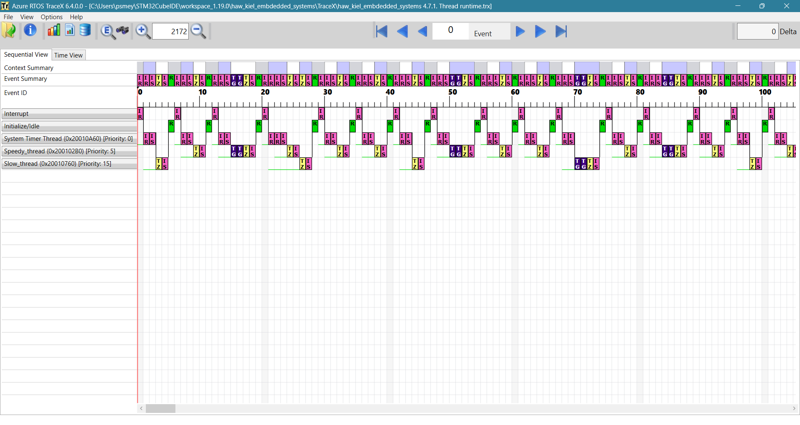
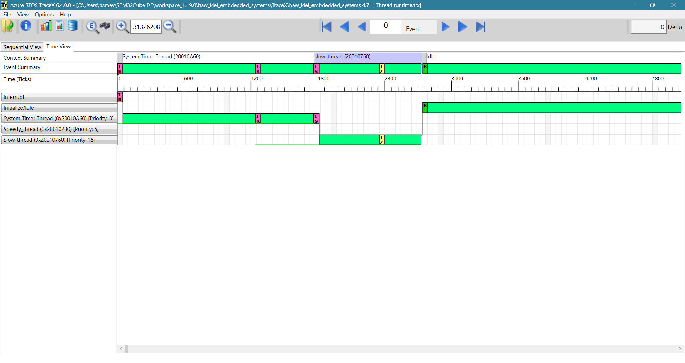
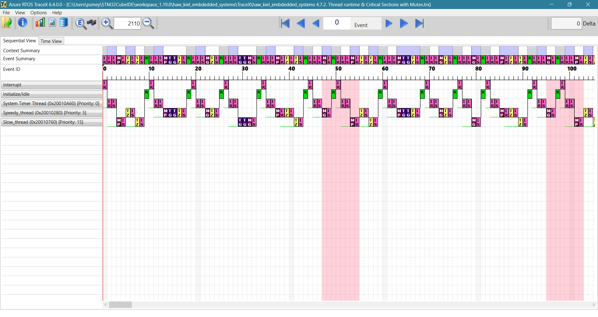
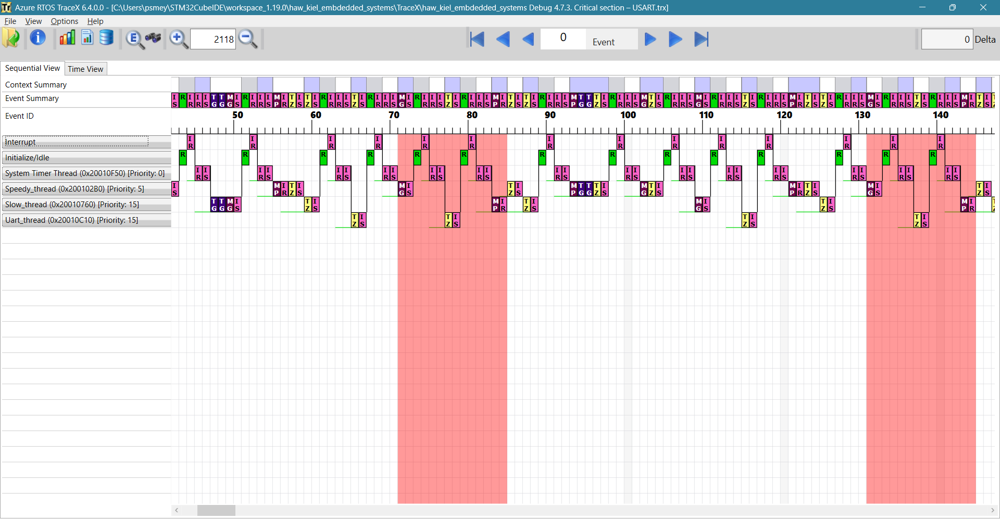
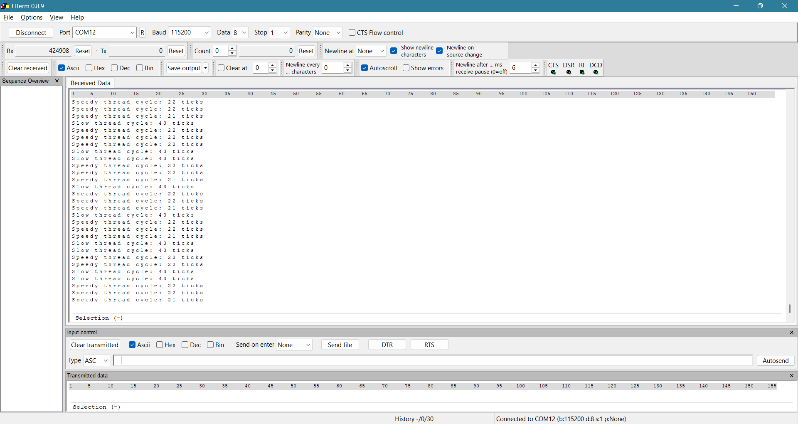
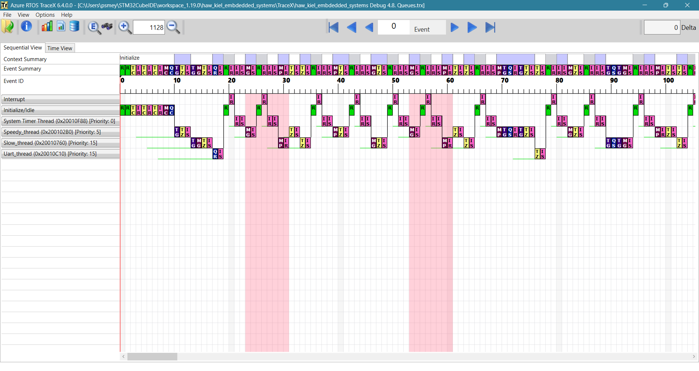
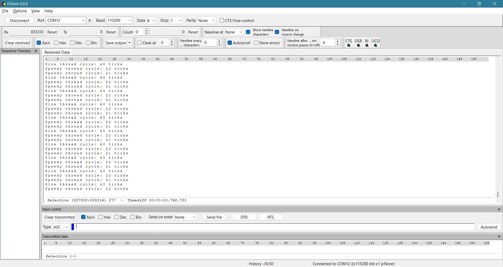

# HAW Kiel Embedded Systems

## Tasks

### 4.6 TraceX

Add Azure RTOS ThreadX Support

https://community.st.com/t5/stm32-mcus/how-can-i-add-tracex-support-in-stm32cubeide/ta-p/49380

### 4.7.1 Critical sections





USART Output:

```
Slow thread cycle: 40 ticks
Speedy thread cycle: 14 ticks
Speedy thread cycle: 14 ticks
Speedy thread cycle: 14 ticks
Slow thread cycle: 40 ticks
Speedy thread cycle: 14 ticks
Speedy thread cycle: 14 ticks
Speedy thread cycle: 14 ticks
Slow thread cycle: 40 ticks
Speedy thread cycle: 14 ticks
Speedy thread cycle: 14 ticks
Speedy thread cycle: 14 ticks
...
```

### 4.7.2 Thread runtime & Critical Sections



USART Output

```
Slow thread cycle: 43 ticks
Speedy thread cycle: 22 ticks
Speedy thread cycle: 21 ticks
Slow thread cycle: 43 ticks
Speedy thread cycle: 22 ticks
Speedy thread cycle: 21 ticks
Slow thread cycle: 43 ticks
Speedy thread cycle: 22 ticks
Speedy thread cycle: 21 ticks
...
```
### 4.7.3. Critical section – USART





### 4.8. Queues




