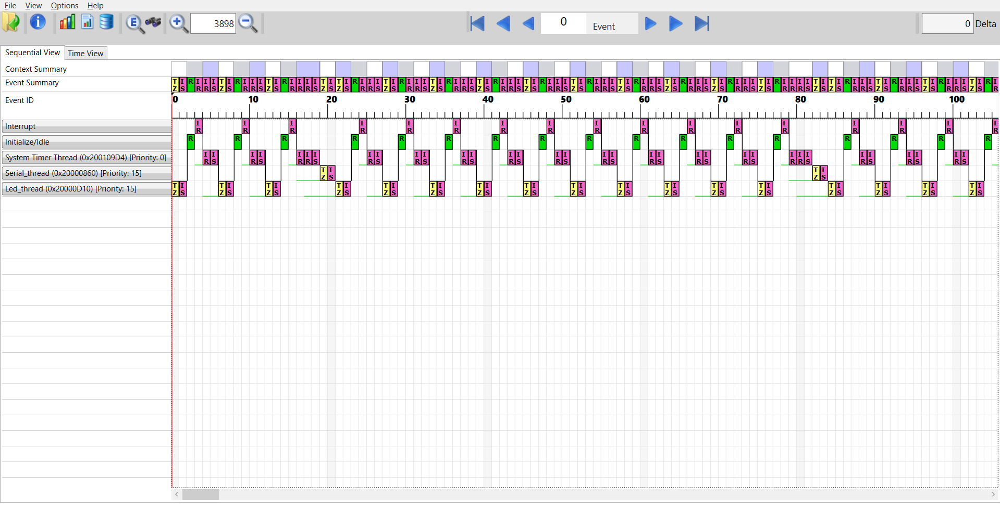
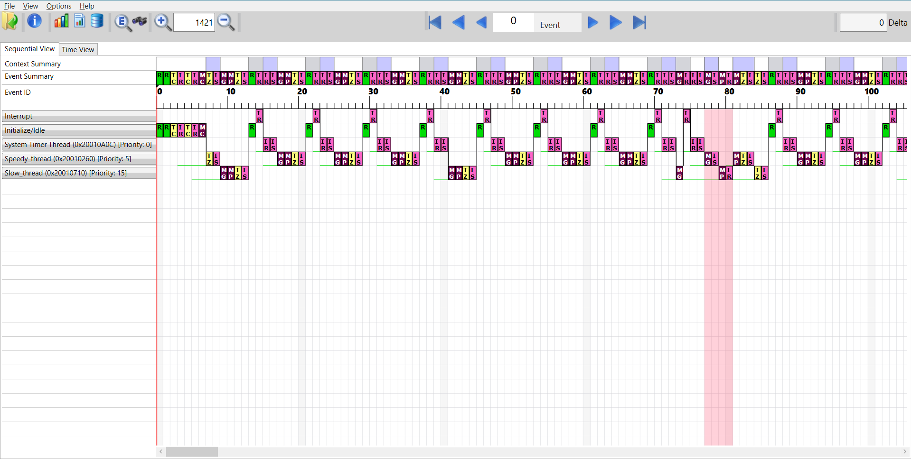
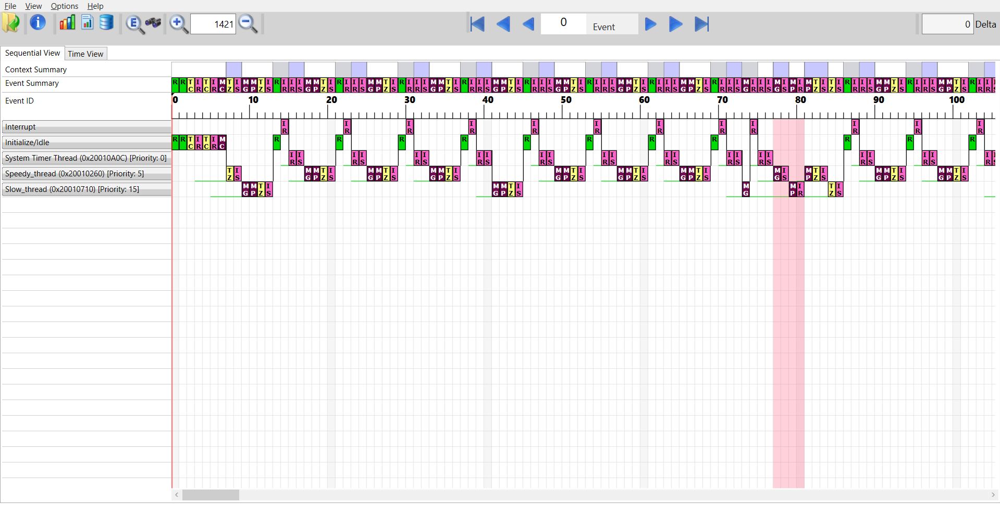

# HAW Kiel Embedded Systems

## Tasks

### 4.6 TraceX

Add Azure RTOS ThreadX Support

https://community.st.com/t5/stm32-mcus/how-can-i-add-tracex-support-in-stm32cubeide/ta-p/49380

### 4.7 Critical sections

Slow thread gets interrupted!

Slow thread gains in priority until it also has a priority of 5.

